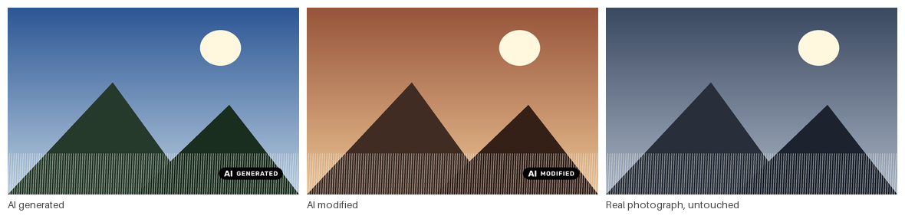

# thumbor-ai-label

A Thumbor plugin that reads AI provenance metadata from the source image and draws a
visible AI label on every generated image style.



!!! info "Pre-1.0"
    Everything documented here works and is covered by tests, but the configuration
    surface may still change.

## Why it exists

**EU AI Act Article 50 has applied since 2 August 2026.** Publishing a deep fake without
disclosing it carries fines of up to €15 million or 3% of worldwide annual turnover.

A publisher is a **deployer** under Article 50(4), which requires *human-perceptible*
disclosure — not the machine-readable marking that binds AI providers under 50(2). A label
burnt into every derivative is exactly that: visible, fixed, embedded, present at first
exposure, and not removable through URL manipulation.

[Read the full mapping onto Article 50 →](eu-ai-act.md)

## One config key

```python
APP_CLASS = "thumbor_ai_label.app.AiLabelServiceApp"
```

No URLs change, no services are added, your `ENGINE` setting is left alone, and labelling
costs well under a millisecond per request.

[Getting started →](getting-started.md)

## What it does not do

- **It only sees what the metadata declares.** An AI image arriving with its provenance
  stripped passes through unlabelled.
- **It over-labels, deliberately.** Article 50(4) covers only deep fakes and exempts
  evidently creative work. The plugin cannot judge realism or intent.
- **It never writes metadata.** Reads only, to decide which label to show.
- **It cannot reach a screen reader on its own.** The label is pixels; your CMS has to
  read the [meta endpoint](configuration.md#the-meta-endpoint) and write the alt text.

## Where things are

| | |
|---|---|
| [Getting started](getting-started.md) | Install and minimal configuration |
| [Configuration](configuration.md) | Policy, detectors, icons, meta endpoint, full reference |
| [EU AI Act](eu-ai-act.md) | What the regulation asks and what this covers |
| [How it works](how-it-works.md) | Internals — scanner, detectors, compositing, wiring |
| [Extending](extending.md) | Shipping your own detector |
| [Contributing](contributing.md) | How to help, and what helps most |
